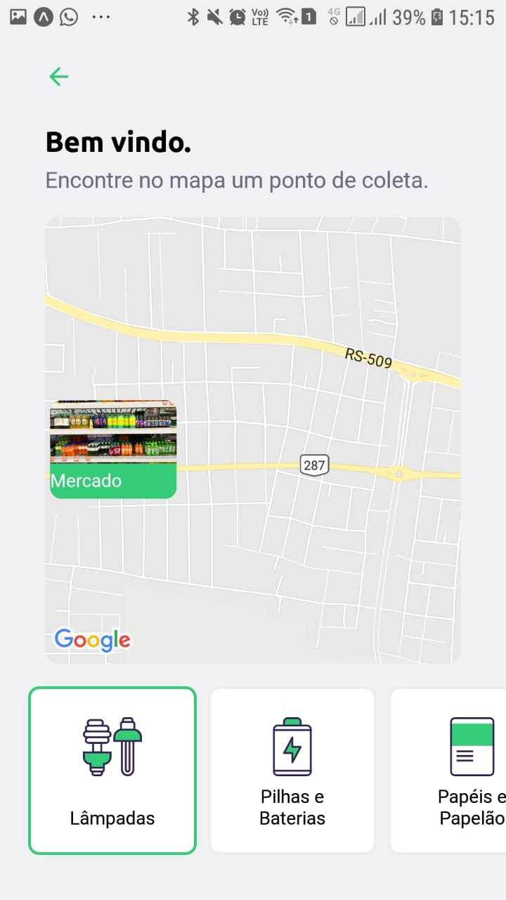

# NLW01 - Ecoleta

Aplicação desenvolvida durante a Next Level Week 01.

Aplicação *Ecoleta*

# Aplicação web
Responsável por cadastrar os pontos de coletas.

## Tela inicial

## Tela cadastro

# Aplicação mobile
Responsável por buscar locais de coletas.

## Tela inicial

## Tela de pontos cadastrados

## Tela de detalhes do ponto selecionado

